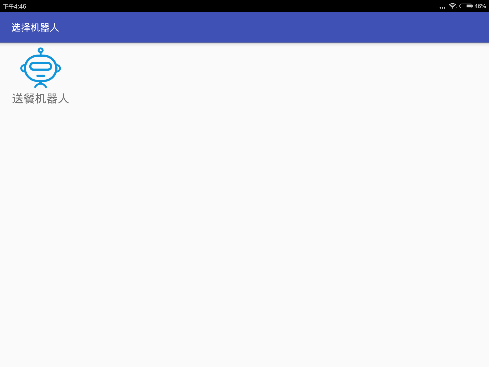
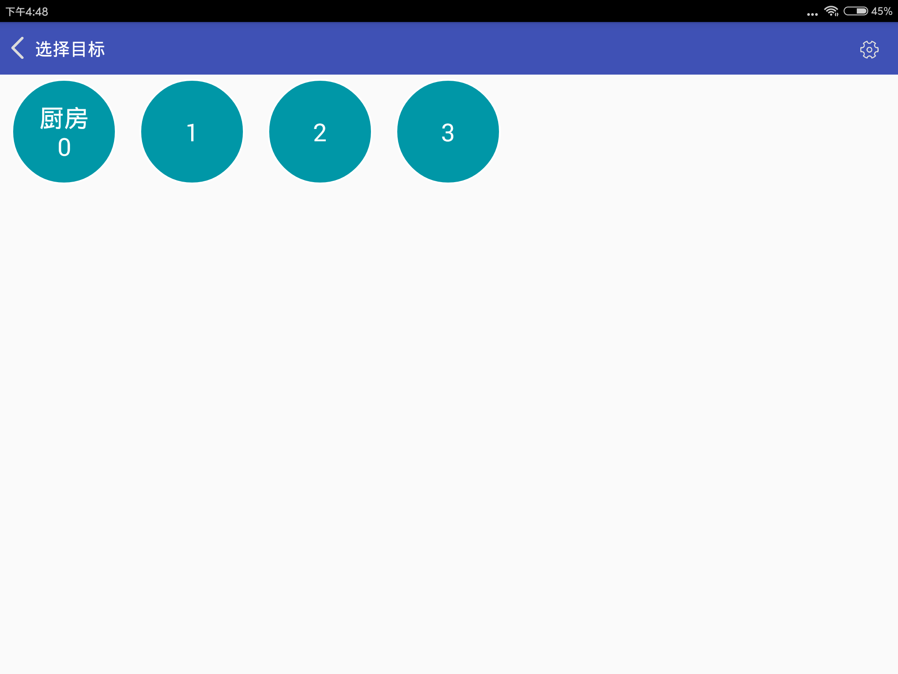
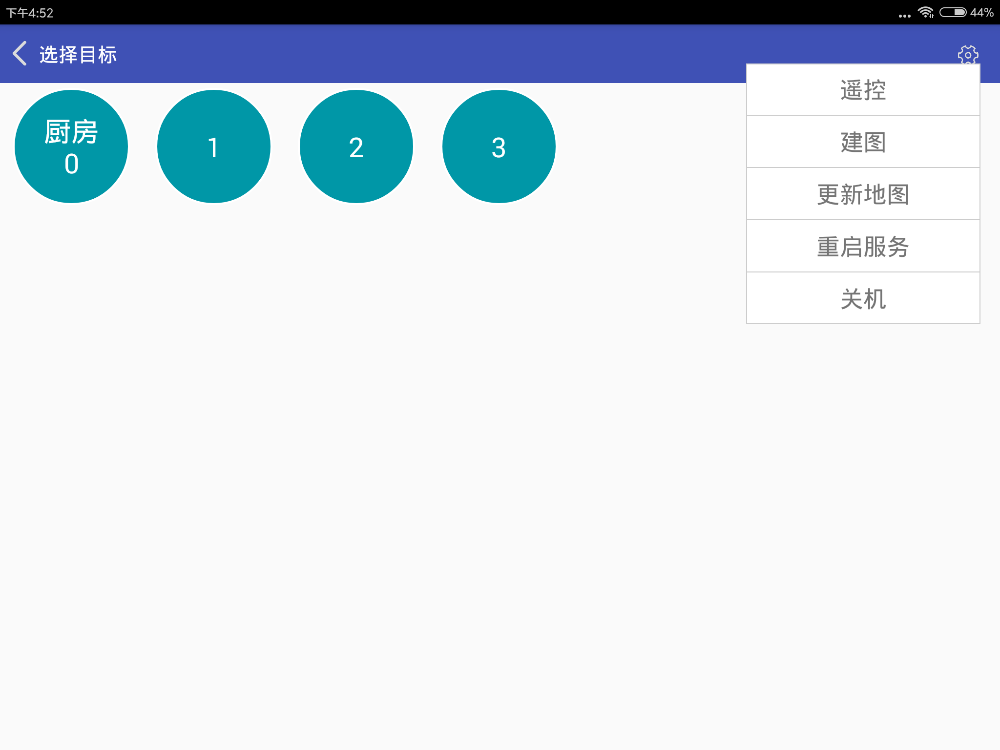

# 基础操作

## 连接机器人

首先打开机器人开关，等待机器人语音提示自检完成。

然后将平板连接到机器人的路由器，启动APP。此时在APP界面中可以看到机器人图标。

点击机器人图标进入机器人控制界面。

## 关机功能

连接机器人后，进入主界面。点击右侧菜单栏会看到如下界面

点击关机会关闭机器人电脑。此时机器人底盘不会断电。如果想要完全关机需要再手动关闭机器人总开关。建议每次关闭机器人时先点击关机等待机器人关机完成后，再关闭机器人总开关。

## 重启服务

在上面的右侧菜单栏中点击重启服务将重启机器人导航控制程序。

一般情况下不需要使用此功能。在机器人运行异常时重启服务可能让机器人恢复正常。

## 休眠功能

如果机器人长期处于选择目标界面且用户没有下发任务，机器人等待10分钟后会自动进入休眠状态。在休眠状态下机器人会为了省电关闭一些程序。此时点击平板机器人就会自动从休眠状态恢复。