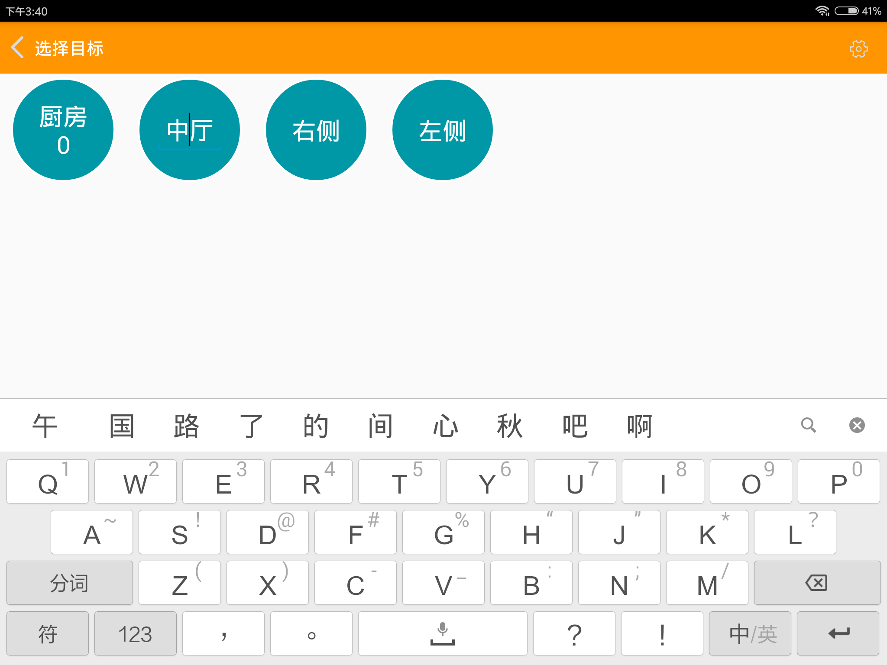

# 基础操作

## 连接机器人

首先打开机器人开关，等待机器人语音提示自检完成。

然后将平板连接到机器人的路由器，启动APP。此时在APP界面中可以看到机器人图标。

点击机器人图标进入机器人控制界面。

## 关机功能

连接机器人后，进入主界面。点击右侧菜单栏会看到如下界面

点击关机会关闭机器人电脑。此时机器人底盘不会断电。如果想要完全关机需要再手动关闭机器人总开关。建议每次关闭机器人时先点击关机等待机器人关机完成后，再关闭机器人总开关。

## 重启服务

在上面的右侧菜单栏中点击重启服务将重启机器人导航控制程序。

一般情况下不需要使用此功能。在机器人运行异常时重启服务可能让机器人恢复正常。

## 休眠功能

如果机器人长期处于选择目标界面且用户没有下发任务，机器人等待10分钟后会自动进入休眠状态。在休眠状态下机器人会为了省电关闭一些程序。此时点击平板机器人就会自动从休眠状态恢复。

## 重命名机器人

为了更加方便的使用机器人，用户可以根据自己的需要给机器人重新命名。重命名方法比较简单，直接长按机器人图标，机器人图标就会进入可修改状态。

修改完成后随意点击其他位置就可以退出修改状态了。注意机器人的名称不能太长，太长可能会无法显示完全。

## 重命名目标点

在建立完成地图之后，用户可以修改目标点的名称。比如将一号桌改名为大厅，二号桌改为走廊。修改方式和重命名机器人一样。长按目标点按钮进行修改。

修改完成后随意点击其他位置就可以退出修改状态了。

## 定制语音提示

用户可以对机器人的语音提示进行定制

在已经安装了app上的手机或平板上，app会自动创建一个叫chitu的文件夹。在chitu文件夹内存在一个叫audio的文件夹。可以在audio文件夹内部放入对应的声音文件替换掉默认的语音提示。
放入的语音文件格式必须为wav，文件名对应不同的语音内容。语音文件名称和语音对应关系如下

|文件名|系统默认语音内容|
|--|--|
|厨房放餐提示|请在放好后点击目标|
|低电量提示|电池电量过低请及时充电|
|到达提示|您点的餐到了，请在取餐后点击返回|
|返回提示|我回去了，您慢用|
|闭环优化开始|开始闭环优化，请先等待一会|
|闭环优化完成|闭环优化完成，你可以继续操作了|
|暂停任务|已经暂停任务|
|继续任务|继续任务|
|取消任务|取消任务|
|返回厨房提示|我回来了|
|导航系统未初始化提示|视觉尚未初始化，请遥控机器人到之前建立过地图的位置|
|导航服务未开启提示|导航服务尚未开启，请等待一会|
|开始返回厨房提示|正在返回厨房|
|移动向餐桌提示|正在前往x号桌|
