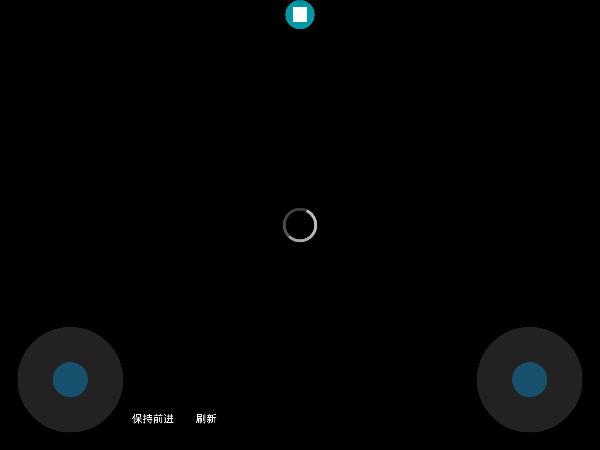
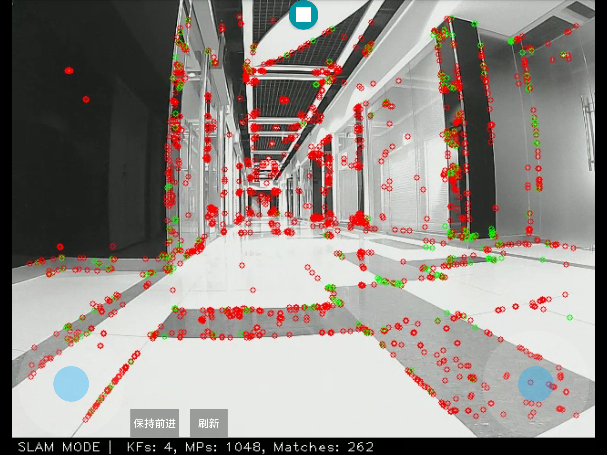
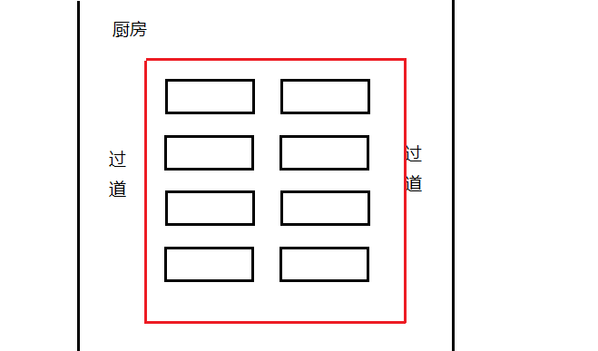
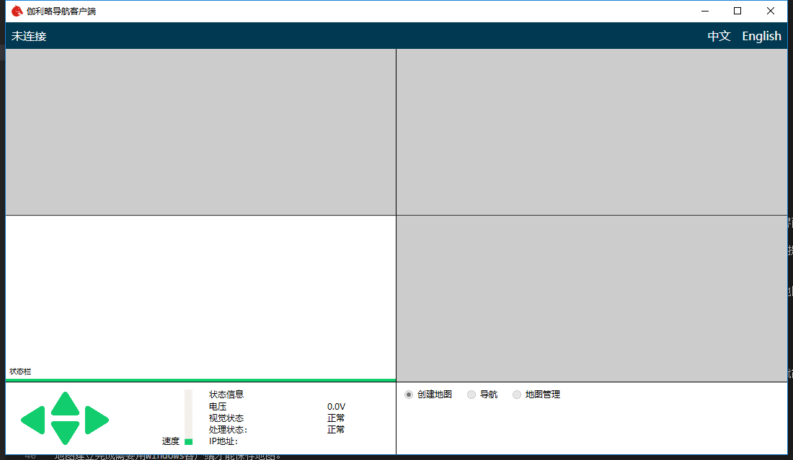
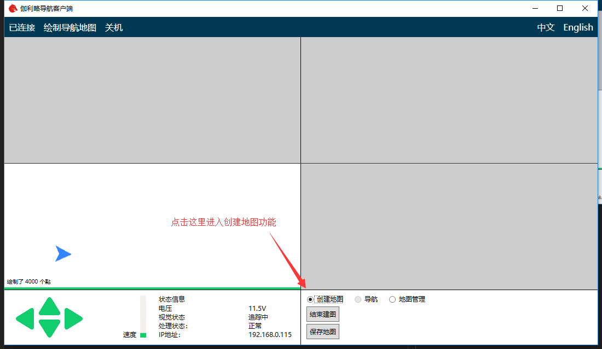
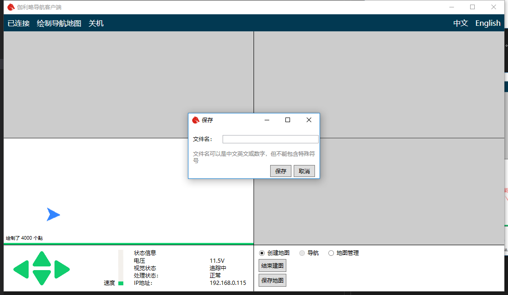

# 创建地图功能

## 创建地图

在想让机器人开始送餐之前，需要我们先带领机器人认识一下周围的环境。这个过程就是创建地图的过程。创建地图可以通过平板程序进行辅助操作，但是这个过程中Windows客户端还是必须的。

首先按照基础操作中的连接方法，将平板客户端和Windows客户端连接机器人。

进入机器人任务控制界面，点击右侧齿轮形状按钮。在弹出的菜单中选择创建地图

接着会弹出创建地图界面。界面如下图所示

可以看到界面中央有一个进度图标。此图标说明机器人正在进入建图模式，机器人需要预先载入相关程序。请等待进度图标消失后再进行操作。

在进入图标消失后，保证机器人附近没有障碍物即可开始建图了。我们首先遥控机器前后移动一段距离。正常情况下会出现下面的界面。

出现此界面就说明视觉导航已经初始化了。可以开始遥控机器人四处走动建立地图了。
遥控过程中尽量避免纯转动（只按左转或右转，这容易使视觉系统丢失目标），请按住前进键的同时按左转或右转，使机器人沿大半径轨迹转弯。遥控过程中要保证界面中的视频始终有红色和绿色的点。

遥控过程中视觉指示状态如果出现“闭环优化中”,请暂时不要操作机器人。当机器人走过的路径形成了一个圈时，机器人会自动的优化之前建立的地图，这样会极大的提高地图质量。因此在建图过程中可以遥控机器人多次走闭合的路径，这样会建立出更加精确的地图。建图的质量会极大的影响之后导航的效果。

由于在同一条路线上向前看和向后看有着完全不同的视野。所以为了保证机器人能够在同一路线上既可以正向走也可以反向走，我们需要在同一路线正向和反向都建立地图。

一般比较好的建图方式，以下面的餐厅布局为例

两侧为过道，中间是桌子。我们可以遥控机器人按照红色路线首先顺时针转一圈。在客户端提示闭环优化完成之后再逆时针转一圈。同样也需要闭环优化完成。这样就能获取到比较好的建图效果。

注意建图的质量会极大的影响之后导航的效果。

## 保存地图

地图建立完成需要用Windows客户端才能保存地图。

保持平板程序运行在建图的界面，同时在电脑上打开Windows客户端。界面如下图所示

将电脑连接至机器人网路。点击左上角未连接按钮。之后客户端开始自动连接机器人。

等待载入完成客户端会如下显示

点击上图的保存地图按钮，在弹出的对话框输入地图名称。注意地图名称不能包含特殊字符。

之后点击保存地图就保存完成了。

现在可以关闭平板的程序了。之后可以点击Windows客户端下面的结束建图按钮关闭建图程序。

地图建立完成后需要绘制导航路线才能使用。路线的绘制方法请参考Windows客户端的绘制导航路径的相关说明。