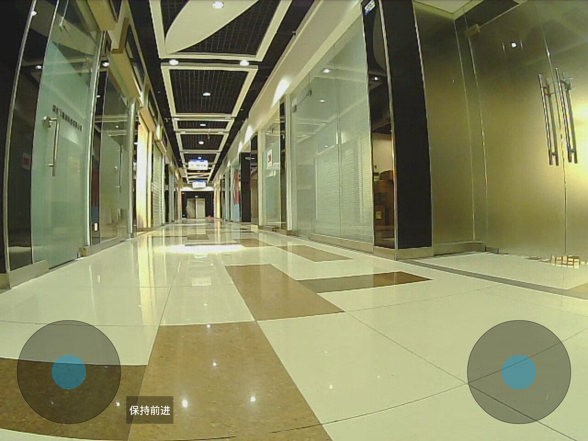

# 遥控机器人

按照基础操作中的说明连接机器人，进入任务列表界面。

点击右上角的齿轮形状的设置按钮。在弹出的菜单中选择遥控功能

界面中有两个圆形的方向控制按钮。左侧按钮只可以前后移动，用来控制机器人前进后退的速度。向上推动即为向前加速，向后拖动即为向后加速。通过拖动距离的大小控制机器人的速度。

右侧的圆形按钮只可以左右移动，用来控制机器人的转向速度。向左拖动即控制机器人左转，向右拖动控制机器人右转。通过拖动的长度控制机器人的转向速度。

整个界面的背景是机器人的摄像头采集到的图像。

遥控的有效距离为机器人WiFi的覆盖范围。所以在遥控时请注意控制和机器人间的距离。
