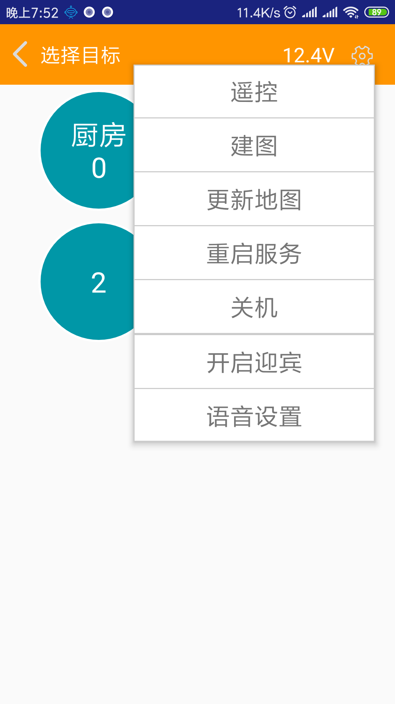
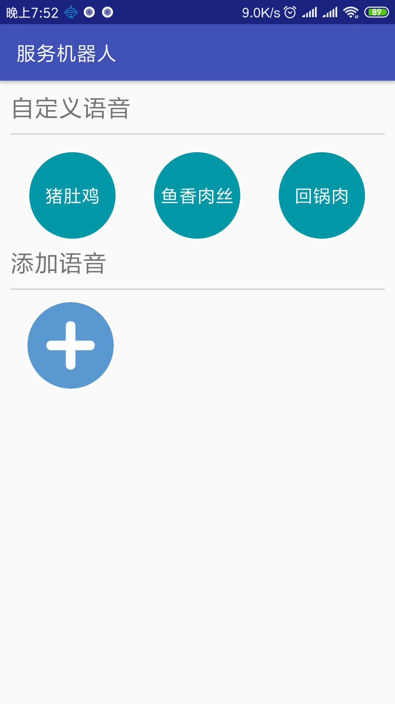
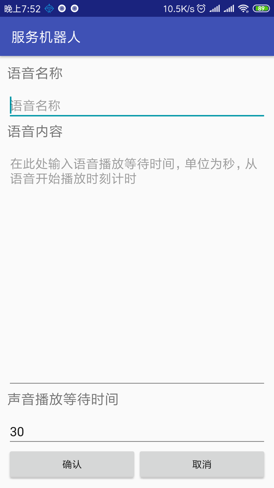
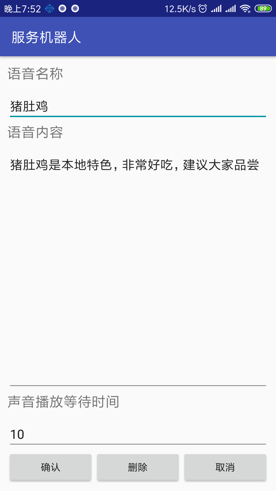
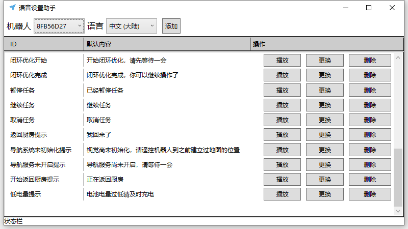
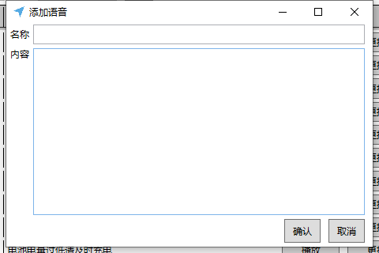

# 商品推销功能

送餐机器人搭载商品推销功能。启动此功能后机器人会向客户介绍商品。

首先按照之前的介绍，连接机器人。点击菜单中最下方的语音设置。

点击下面的加号按钮添加语音

按照提示进行修改

注意根据语音内容的长度设置等待时间。等待时间单位为秒，计时从语音开始播放时。

设置好之后点击确认按钮。这事回到语音界面就能看到自己添加的语音了。点击自己添加的语音，机器人就会播放对应的声音。

此时返回机器人导航控制界面，机器人仍然会按照刚才设置的等待时间循环播放你设置的语音。现在机器人就可以开始向你的客人们推销商品了。

如果之前设置的觉得不满意，那也没关系。长按自己添加的语音就可以进入修改界面

修改完成后点击确认。如果不需要这个语音了，也可以直接点击下面的删除按钮。

## 高级玩法

如果我不想要机器人简单的播放文字语音。我想要机器人播放自己的宣传音乐文件可以吗？这样也是可以的。我们可以配合伽利略语音助手来实现这个功能。

语音助手的使用可以参照[这里](https://doc.bwbot.org/en/books-online/galileo-servicebot-doc/audio.html)

语音助手主界面如下图所示

点击右上角的添加按钮，进入添加语音界面。

和APP中的语音设置保持完全一样。比如刚才猪肚鸡的语音如果你想要替换成自己的音频文件，就把刚才猪肚鸡的语音名称和内容一模一样的填进去。然后点击确认，注意连标点符号都要一样。

添加完成后语音列表内就会增加一个刚才你添加的项目。点击更换按钮，替换成自己的音频文件。这时候再从APP上点击，就会发现语音文件已经被替换了。
