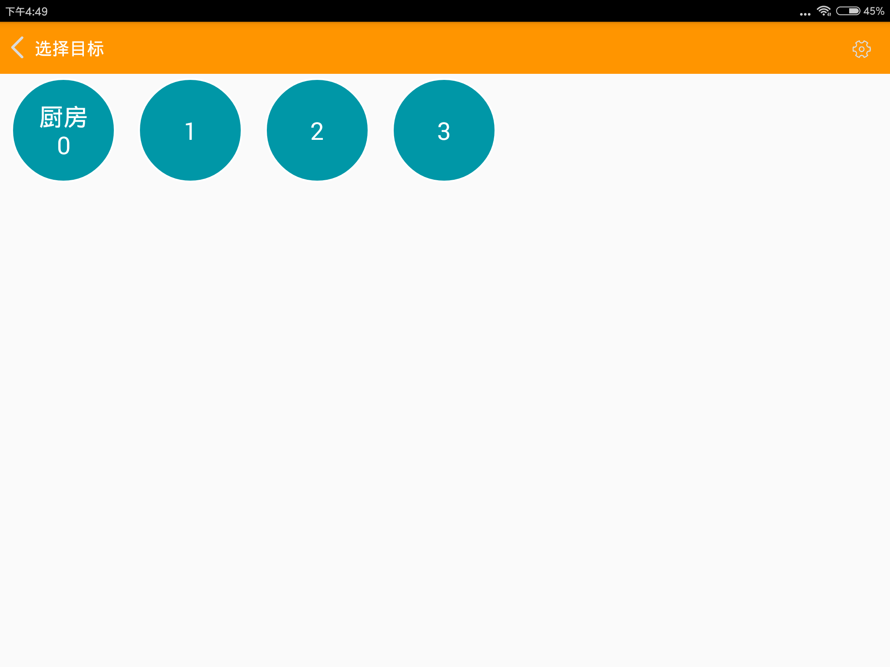

# 送餐功能

我们可以通过平板程序控制机器人送餐任务。设置送餐的目的地等等。

在送餐之前我们需要先给机器人创建好地图，然后设置餐厅路线。具体操作可以参考创建地图的说明。

按照基础操作里面的说明，连接机器人并进入任务列表界面。

在这个界面中，每一个按钮代表着一个位置。其中包含厨房和每个桌子的位置。

在刚启动这个界面的时界面可能如上图所示。最上面的标题栏时黄色的。说明机器人现在还在载入相关的程序，还没有完成初始化。等待标题栏变成蓝色就可以开始使用了。

想要机器人送餐到对应的桌子直接点击桌号即可。如果机器人状态没有准备好会有相关的语音提示，请根据语音提示进行操作。任务启动失败的时候可以等几秒钟之后再尝试启动任务。

二代客户端启动界面如下

二代增加同时多桌送餐的功能。首先点击想要机器人依次送餐的桌号，然后点击右下角的送餐按钮。机器人就会自动开始送餐了。送餐的顺序就是之前点击桌号的顺序。送餐完成后机器人会自动回到厨房。

在没有点击桌号，直接点击右下角送餐按钮的情况下，机器人会自动返回厨房。

启动成功后界面如下图所示

中间的按钮为暂停按钮。点击后机器人会暂停移动。暂停后的界面如下图所示

这两个为继续任务和取消任务按钮。点击按钮对应继续和取消任务。

在任务执行界面中，有时机器人在运行过程中标题背景会变成黄色。如下图所示。

此时代表机器人摄像头定位暂时失效。可能的原因是摄像头被遮挡，或者机器人运行到之前没有建立地图的位置。也有可能是环境变化过大，比如如果在中午建立的地图可能晚上会出现丢失的情况。如果在运行过程中只是短暂的出现黄色警告对导航过程并无影响。如果在运行过程中持续出现黄色警告说明地图已经和建立时差别过大。需要更新地图后才能稳定使用。一般来说经过多次更新的地图会更加稳定可靠。更新地图的方法可以参见更新地图说明文档。

在机器人到达目标送餐位置时，机器人会语音提示用户在取餐后触摸开关。用户触摸开关后机器人会自动返回厨房。如果用户一直未触摸开关机器人会等待一分钟，之后自动返回厨房。

除了触摸开关，用户也已触摸平板返回按钮。触摸后机器人会自动返回厨房。

