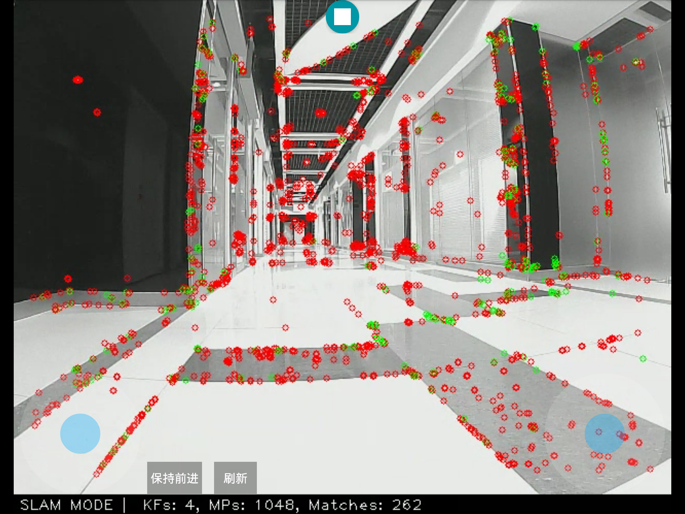
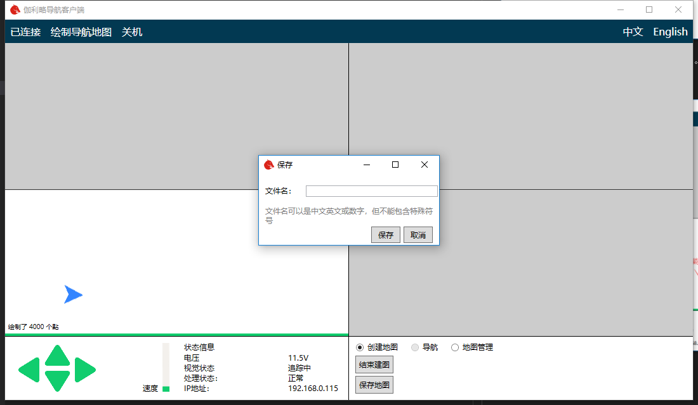

# 更新地图

在实际的使用过程中，由于场景变化可能会出现之前建立的地图很多地方容易丢失，导航不稳定的问题。这时候需要更新地图之后在使用。随着更新地图次数的增加地图也更加稳定可靠。

首先确保之前已经成功创建过地图。然后将客户端连接至机器人路由器，并按照基础操作里面的说明连接机器人。

连接成功后点击右侧菜单栏

在弹出的菜单中选择更新地图选项

在更新地图刚启动时机器人需要切换到建图模式，同时载入之前建立的地图。如果之前建立的地图比较大可能载入速度会相对较慢。请等待载入进度图标消失后再操作。

载入完成后，遥控机器人移动到之前建立过地图且现在仍能够稳定追踪的位置。当机器人人成功追踪定位时会显示如下界面。

这个界面和建图界面是一样的，更新地图的过程和建图过程也很类似。也是遥控机器人在周围环境走一走。具体的移动要求可以参考建图说明。

在地图更新完成之后和建图过程一样也需要Windows客户端进行保存。

保持平板程序运行在更新地图的界面，同时在电脑上打开Windows客户端。界面如下图所示

将电脑连接至机器人网路。点击左上角未连接按钮。之后客户端开始自动连接机器人。

等待载入完成客户端会如下显示

点击上图的另存为按钮，在弹出的对话框输入地图名称。注意地图名称不能包含特殊字符。

之后点击保存地图就保存完成了。

现在可以关闭平板的程序了。之后可以点击Windows客户端下面的结束更新按钮关闭建图程序。

注意更新地图可能会导致地图的整体形状发生变化，使得之前绘制的导航路线出现偏差。你可以在更新地图后再Windows客户端查看路径是否有偏差。如果出现偏差则需要重新绘制路径。